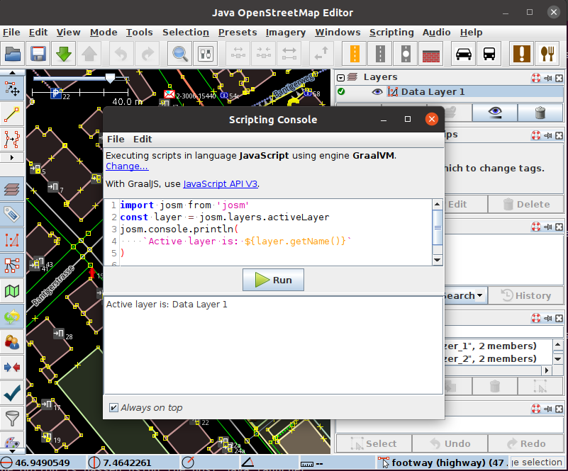

# JOSM Scripting Plugin
## Run scripts in the Open Street Map editor JOSM

The JOSM Scripting Plugin is a plugin for the [Open Street Map]{:target="external"} editor [JOSM]{:target="external"}.

It includes the [Graal.JS](Graal.js){:target="external"} scripting engine for Javascript  and the [API V2](/api/v2) to manipulate JOSMs internal application objects with JavaScript.

For historical reasons it also includes the [Rhino](Mozilla Rhino){:target="external"} scripting engine for Javascript  and the [API V1](/api/v1) to manipulate JOSMs internal application objects with JavaScript. This API is **deprecated**. The Rhino engine and the API V1 will be removed from the scripting plugin in Q3/2021.

```js
const josm = require('josm')
const command = require('josm/command')
const { NodeBuilder } = require('josm/builder')
const restaurant = new NodeBuilder()
  .withTags({amenity: 'restaurant'})
  .withPosition(12.34,45.67)
  .create()
command.add(restaurant).applyTo(
  josm.layers.activeLayer
)
josm.alert('Added a node')
```



It also executes Python scripts and can [load and execute plugins](doc/python.html) written in Python.

In addition, it can execute scripts written in [Groovy], [Ruby], or any other language for which a JSR-223 compatible script engine is available.	


[Open Street Map]: http://www.openstreetmap.org
[JOSM]: http://josm.openstreetmap.de
[Mozilla Rhino]: http://www.mozilla.org/rhino/
[Groovy]: http://groovy.codehaus.org/
[Ruby]: http://www.ruby-lang.org